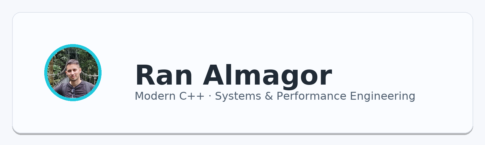

  

 

  

    <!-- Section header -->
    <h2 style="margin:0 0 8px 0;color:#1f2937;">About Me</h2>
    

      I am a Computer Science student with academic experience in <b>algorithms</b>, <b>computer architecture</b>, and <b>networking</b>. 
      My academic journey included developing a predictive model for medical readmission, leading to <i>Israel's first publication of its kind</i>.
    

    

      Currently, I am expanding my knowledge in <b>Modern C++</b> for high-performance computing, combining my analytical background
      with practical training to build efficient and scalable software solutions.
    

    

    <!-- Two-column layout -->
    <table width="100%" style="border-collapse:collapse;">
      <tr valign="top">
        <td style="width:50%; padding-right:12px;">
          <h3 style="margin:0 0 10px 0;color:#1f2937;">Core Academic Experience</h3>
          <ul style="list-style:none; padding-left:0; margin:0; color:#334155; line-height:1.7;">
            <li style="margin:4px 0;">▸ Algorithms & Data Structures</li>
            <li style="margin:4px 0;">▸ Discrete Mathematics</li>
            <li style="margin:4px 0;">▸ Computer Architecture</li>
            <li style="margin:4px 0;">▸ Python & Machine Learning (Final Project & Publication)</li>
            <li style="margin:4px 0;">▸ Networking</li>
            <li style="margin:4px 0;">▸ Cloud (AWS – courses & certifications)</li>
          </ul>
        </td>
        <td style="width:50%; padding-left:12px;">
          <h3 style="margin:0 0 10px 0;color:#1f2937;">Current Focus</h3>
          <ul style="list-style:none; padding-left:0; margin:0; color:#334155; line-height:1.7;">
            <li style="margin:4px 0;">▸ <b>Modern C++ (C++17/20):</b> RAII, smart pointers, exceptions</li>
            <li style="margin:4px 0;">▸ <b>OO Design & Polymorphism:</b> abstract interfaces, virtual dispatch</li>
            <li style="margin:4px 0;">▸ <b>Templates:</b> function/class templates, type traits basics</li>
            <li style="margin:4px 0;">▸ <b>Tooling:</b> CMake, unit tests, clean project structure</li>
            <li style="margin:4px 0;">▸ <b>Next:</b> first C++ projects to apply skills (+ Spanish & fitness)</li>
          </ul>
        </td>
      </tr>
    </table>

  

